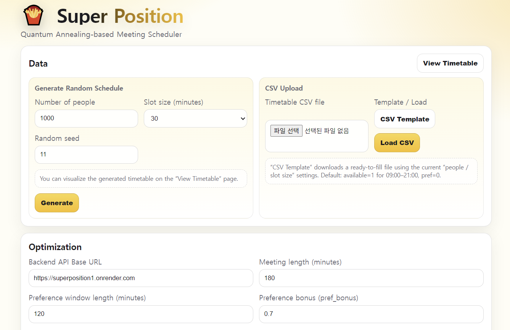

<h1 align="center">🍟 Super Position</h1>

<p align="center">
  <b>Quantum Annealing-based Meeting Scheduler</b><br/>
  Find the best meeting time across a weekly timetable using <b>SA</b> / <b>QA (D‑Wave)</b>.
</p>

<p align="center">
  🌐 <b>Live Demo</b>: https://eyedicamp.github.io/SuperPosition/frontend/
</p>

<p align="center">
  
</p>

---

## ✨ What it does

- 🗓️ Build / upload a weekly timetable (Mon–Sun)
- 🧩 Set meeting length + preference window
- ⚖️ Add attendee weights (important people matter more)
- 🚀 Run optimization:
  - 🧊 **SA** (Simulated Annealing, `dwave-neal`)
  - ⚛️ **QA** (Quantum Annealing on D‑Wave QPU)
- 🥇 Get the best start time + Top‑K candidates with a visual timetable overlay

---

## 🧱 Project Structure

```
.
├─ index.html              # redirects to /frontend
├─ backend/
│  ├─ app.py
│  ├─ Dockerfile
│  └─ requirements.txt
└─ frontend/
   ├─ index.html
   ├─ app.js
   ├─ styles.css
   ├─ timetable.html
   └─ timetable.js
```

- 🎛️ Main UI: `frontend/index.html`
- 🧾 Timetable viewer: `frontend/timetable.html`
- ↪️ Redirect: root `index.html`

---

## 📦 Backend Dependencies

`backend/requirements.txt` includes (high-level):

- ⚡ `fastapi`, `uvicorn[standard]`, `pydantic`
- 🧊 `dwave-neal` (SA)
- ⚛️ `dwave-system` (QA / D‑Wave)

---

## 🧾 CSV Format

Header:

```
slot_minutes,person_id,weight,day,time,available,pref
```

- `day`: `Mon,Tue,Wed,Thu,Fri,Sat,Sun`
- `time`: `HH:MM`
- `available`: 1 / 0
- `pref`: 1 / 0 (preference start-slot hint)

---

## 🧮 QUBO Formulation (Quantum Annealing)

This project can solve the “best meeting start time” problem via **QUBO** (Quadratic Unconstrained Binary Optimization), which is the standard form used by **quantum annealers** (and also by many classical annealing solvers).

### 1) Time discretization

Let the week be discretized into fixed-size slots (e.g., 30 minutes). Define:

- Total number of slots: $T$
- Meeting length in slots: $L$ (e.g., 180 minutes with 30-min slots $\Rightarrow L=6$)
- Candidate meeting start slots: $s \in \{0,1,\dots,T-L\}$

### 2) Decision variables

We use a **one-hot** binary vector over start times:

```math
x_s \in \{0,1\}\quad \text{for } s=0,\dots,T-L
```

where:

- $x_s = 1$ means “the meeting starts at slot $s$”
- exactly one start time must be chosen

### 3) Precomputed feasibility and preference indicators

For each person $i\in\{1,\dots,N\}$, define:

- Weight (importance): $w_i \ge 0$
- Slot-level availability: $a_{i,t}\in\{0,1\}$ for each slot $t$
- Start preference indicator: $p_{i,s}\in\{0,1\}$ for each start $s$ (UI: `pref_start_ok`)

A person can attend a meeting starting at $s$ **only if they are available for all $L$ consecutive slots**:

```math
A_{i,s} \;=\; \prod_{k=0}^{L-1} a_{i,s+k} \in \{0,1\}
```

So $A_{i,s}=1$ iff person $i$ is available for the entire meeting window $[s, s+L-1]$.

Late-time overlap penalty:

- Late threshold slot index: $t_{\text{late}}$ (derived from `late_hour`)
- Number of late slots overlapped by a meeting starting at $s$:

```math
\ell_s \;=\; \sum_{k=0}^{L-1} \mathbf{1}\{s+k \ge t_{\text{late}}\}
```

### 4) Utility of choosing a start time

For each candidate start $s$, we compute its utility as:

```math
W_s \;=\; 
\underbrace{\sum_{i=1}^{N} w_i A_{i,s}}_{\text{weighted attendance}}
\;+\;
\underbrace{\beta \sum_{i=1}^{N} w_i A_{i,s} p_{i,s}}_{\text{preference bonus}}
\;-\;
\underbrace{\rho \,\ell_s}_{\text{late-time penalty}}
```

where:

- $\beta$ is `pref_bonus`
- $\rho$ is `late_penalty_per_slot`

Interpretation:

- Weighted attendance rewards selecting a slot where high-weight people can attend the full meeting.
- Preference bonus adds extra value when the selected start aligns with attendee start-time preferences.
- Late penalty discourages solutions that overlap “late hours”.

### 5) Constraint: choose exactly one start time

The “exactly one” requirement is encoded as a squared penalty:

```math
\left(\sum_{s=0}^{T-L} x_s - 1\right)^2
```

This equals 0 only when exactly one $x_s$ is 1.

### 6) Final QUBO objective (energy)

Quantum annealers minimize energy. We therefore **maximize** $W_s$ by minimizing $-W_s$ while enforcing one-hot:

```math
E(\mathbf{x}) \;=\;
\lambda\left(\sum_{s=0}^{T-L} x_s - 1\right)^2
\;-\;
\sum_{s=0}^{T-L} W_s x_s
```

- $\lambda>0$ is a penalty coefficient large enough to enforce feasibility.

Expanding the squared term yields a standard QUBO with linear and quadratic coefficients:

```math
E(\mathbf{x})
=
2\lambda \sum_{s=0}^{T-L} \sum_{t=s+1}^{T-L} x_s x_t
+ \sum_{s=0}^{T-L}(-W_s - \lambda)x_s
+ \lambda
```

So the QUBO matrix $Q$ can be constructed as:

- Diagonal (linear) terms: $Q_{s,s} = -W_s - \lambda$
- Off-diagonal (quadratic) terms for $s<t$: $Q_{s,t} = 2\lambda$

### 7) Practical note on choosing $\lambda$

To guarantee feasibility (exactly one start), $\lambda$ must dominate the gain of selecting multiple starts. A commonly used safe heuristic is:

```math
\lambda \;>\; \max_s |W_s|
```

In practice, $\lambda$ may also be tuned to fit QPU coefficient ranges and to balance numerical stability. If $\lambda$ is too small, the solver may return invalid solutions (multiple $x_s=1$). If it is too large, the objective signal can be numerically compressed, reducing optimization sensitivity.

---

## 🌈 Deploy Notes

- 🧁 **Frontend**: GitHub Pages (root redirects → `/frontend`)
- 🛠️ **Backend**: Render / Fly.io / any FastAPI hosting
- 🔗 In the UI, set “Backend API Base URL” to your deployed backend URL
